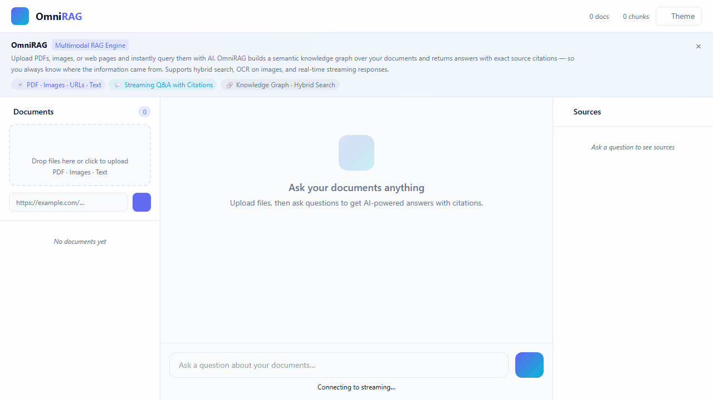
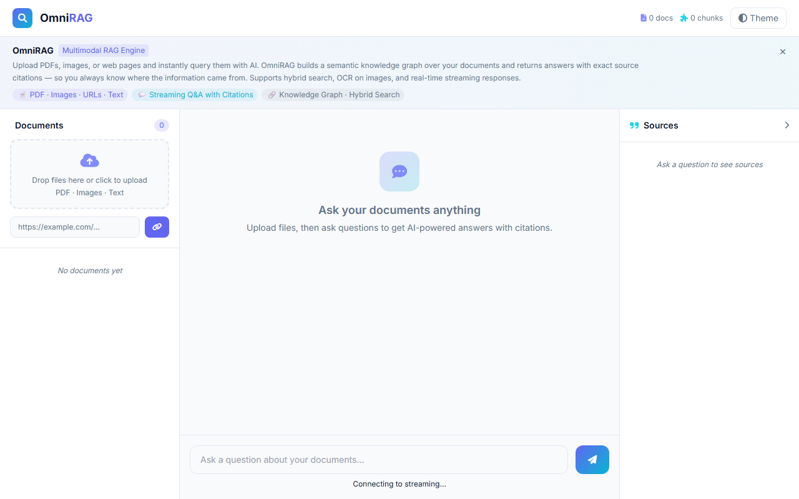
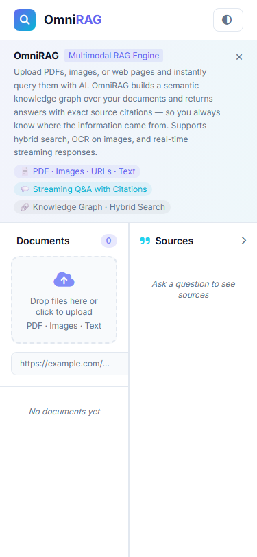

# OmniRAG

[](https://github.com/isidhartha/omni-rag/discussions)

## Demo



### Screenshots

| Desktop | Feature View | Mobile |
|---------|-------------|--------|
|  |  |  |


I got tired of the standard RAG demo that only works on one PDF and falls apart the moment you throw anything more complex at it. OmniRAG is what I built to fix that. It handles PDFs, images, codebases, audio, and video — all in the same pipeline. You upload your files, ask questions, and get answers with citations that tell you exactly where each piece of information came from.

The part I spent the most time on is the search layer. Most RAG systems use pure vector search, which works okay but misses things that don't embed well — exact identifiers, code symbols, specific numbers. OmniRAG uses hybrid search: vector embeddings for semantic meaning and BM25 keyword search for precision. Then it reranks the results before passing them to the LLM. That combination gets you meaningfully better answers on real documents.

---

## What it handles

**PDFs** — Full text extraction with chunking, table parsing, and metadata. Works on research papers, contracts, manuals, reports. You can upload a 300-page document and ask questions about specific sections.

**Images** — OCR for text in images plus vision AI for understanding diagrams, charts, and screenshots. If you upload a screenshot of a dashboard, it can read the numbers.

**Code repositories** — AST-aware indexing so it understands structure, not just text. Ask "where is the authentication logic?" and it finds the right function rather than grepping for the word "auth".

**Audio and video** — Transcribes audio using Whisper, then indexes the transcript. Upload a meeting recording and search through what was said.

**Web pages** — Point it at a URL and it scrapes the content into your knowledge base.

**Multi-turn conversation** — It maintains conversation memory, so follow-up questions work. You don't have to repeat context every message.

**Citations** — Every answer includes source references with document name and page or timestamp. You can verify anything it says.

---

## How it works

When you upload a file, it goes through a routing step that figures out what type it is and sends it to the right parser. The output gets chunked into overlapping segments, each chunk gets an embedding, and everything lands in ChromaDB. The BM25 index is built in parallel.

When you ask a question, both indexes get queried simultaneously. The results are merged, reranked by a cross-encoder model, and the top chunks are passed to the LLM with a prompt that forces it to cite sources in its answer.

---

## Supported formats

| Type | Formats |
|---|---|
| Documents | PDF, DOCX, TXT, Markdown |
| Images | PNG, JPG, WEBP, TIFF |
| Code | Python, JavaScript, TypeScript, Go, Java, C++ |
| Audio | MP3, WAV, M4A |
| Video | MP4, MOV, AVI |
| Web | Any URL |

---

## How to run it

**Prerequisites**: Docker and Docker Compose. An OpenAI API key.

**1. Clone and configure**

```bash
git clone https://github.com/isidhartha/omni-rag.git
cd omni-rag
cp .env.example .env
```

Open `.env` and add your key:

```
OPENAI_API_KEY=sk-your-key-here
```

**2. Start everything**

```bash
docker-compose up --build
```

**3. Open the dashboard**

Go to `http://localhost:3000`. Drag a file into the upload area, wait a few seconds for it to index, then start asking questions in the chat panel.

---

## Without Docker

```bash
# Backend

[](https://github.com/isidhartha/omni-rag/discussions)
cd backend
python -m venv .venv
source .venv/bin/activate    # Windows: .venv\Scripts\activate
pip install -r requirements.txt
uvicorn main:app --reload

# Frontend

[](https://github.com/isidhartha/omni-rag/discussions)
cd frontend
npm install
npm run dev
```

---

## API

The backend exposes a full REST API. Swagger UI is at `http://localhost:8000/docs`.

```
POST /api/v1/ingest         — Upload and index a file
POST /api/v1/chat           — Ask a question, get an answer with citations
GET  /api/v1/documents      — List all indexed documents
DELETE /api/v1/documents/{id} — Remove a document from the knowledge base
WS   /ws/chat               — Streaming chat responses
```

---

## Configuration

| Variable | Description | Default |
|---|---|---|
| `OPENAI_API_KEY` | Required for embeddings and LLM responses | — |
| `CHROMA_PERSIST_DIR` | Where ChromaDB stores its data | `/data/chroma` |
| `CHUNK_SIZE` | Characters per chunk | `1000` |
| `CHUNK_OVERLAP` | Overlap between chunks | `200` |
| `TOP_K_RESULTS` | How many chunks to retrieve per query | `5` |

---

## Free local LLM option (no API key needed)

OmniRAG supports [Ollama](https://ollama.com) as a drop-in alternative to OpenAI for chat and summarisation. This lets you run the LLM entirely on your own machine at no cost.

**1. Install Ollama**

Download and install from [https://ollama.com](https://ollama.com), then pull a model:

```bash
ollama pull llama3.2
```

**2. Start Ollama**

```bash
ollama serve
```

**3. Switch OmniRAG to Ollama**

In your `.env` file, set:

```
LLM_PROVIDER=ollama
OLLAMA_BASE_URL=http://localhost:11434
OLLAMA_MODEL=llama3.2
```

That's it. Restart the backend and all chat and RAG responses will use your local model.

**Note on embeddings:** Embeddings still require OpenAI (or the built-in `sentence-transformers` fallback) because Ollama's embedding API differs from the vector pipeline OmniRAG uses. You can run `LLM_PROVIDER=ollama` with an empty `OPENAI_API_KEY` as long as you have `sentence-transformers` installed — the embedding layer will fall back to the local `all-MiniLM-L6-v2` model automatically.

---

## License

MIT. Use it for whatever you need.
