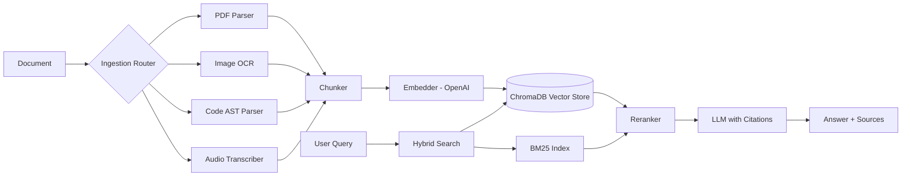

# OmniRAG — Multimodal RAG Knowledge Engine

> Ingest PDFs, images, codebases, audio, and video. Ask questions. Get cited answers.

[](LICENSE)
[](https://python.org)

## Features

- [x] PDF ingestion with chunking and metadata extraction
- [x] Image understanding (OCR + vision AI)
- [x] Codebase indexing (AST-aware semantic search)
- [x] Video/audio transcript extraction
- [x] Enterprise hybrid search (BM25 + dense vectors)
- [x] Persistent conversation memory
- [x] Citations with source + page reference
- [x] Knowledge graph construction
- [x] Multi-turn chat with your documents

## RAG Pipeline



## Supported File Types

| Type | Formats |
|------|---------|
| Documents | PDF, DOCX, TXT, MD |
| Images | PNG, JPG, WEBP, TIFF |
| Code | Python, JS, TS, Go, Java, C++ |
| Audio | MP3, WAV, M4A |
| Video | MP4, MOV, AVI |
| Web | URLs (scraped) |

## Quick Start

```bash
git clone https://github.com/yourusername/omni-rag
cd omni-rag
cp .env.example .env
docker-compose up --build
```

Open `http://localhost:3000`. Upload a PDF and start asking questions.

## License

MIT — see [LICENSE](LICENSE).
